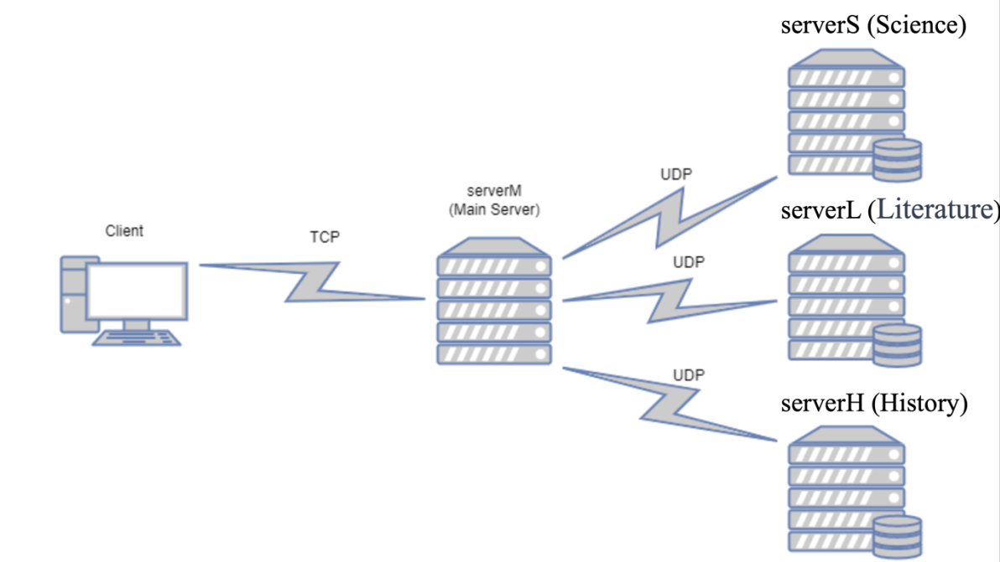

# EE450 Socket Programming Project

## Personal Details

- Full Name: Hao Liang
- Student ID: 4773-3404-69

## Project Description

In this assignment, I implemented a library registration system based on TCP and UDP. I also implement the optional part (admin).

### Backend Server

There are three backend server: Server S, Server L and Server H. They managing different categories of books.

| Server   | Function                  | Input File     |
| -------- | ------------------------- | -------------- |
| Server S | Managing science books    | science.txt    |
| Server L | Managing literature books | literature.txt |
| Server H | Managing history books    | history.txt    |

### Main Server

There is one main server: `Server M`. It has two main functions:

1. The main server accepts login requests from the client and determines whether the user meets the login criteria based on encrypted user list information.
2. The main server accepts query requests from the client and sends requests to different backend servers based on specific requests to obtain book information. Then, it transmits the book information back to the client.

### Client

There is one client: `client`.

#### User Types and Privileges

#### Client Login
- **Initial Step**: Clients must enter a username and password to log in.

#### Regular Users
- **Access**: After logging in, regular users can check the status of books.
- **Book Status**: Includes "Available", "Not Available", and "Not Found".
- **Limitation**: Cannot view the quantity of books.
- **Book Quantity**: Every query for an "available" book decreases its quantity by 1 on the backend server.

#### Administrator Users
- **Privileges**: Administrators have management rights.
- **Book Information**: Can view the quantity of each book.
- **Query Impact**: Their queries do not affect book quantities.

### Communication protocol architecture of the system




> Image Source: EE450 Socket Programming Project.pdf

The Client communicates with server M using TCP. server M communicates with the three backend servers using UDP.

### Port numbers

| Process  | Dynamic Ports |          Static Ports          |
| :------: | :-----------: | :----------------------------: |
| Server M |       -       | 1 UDP, 44469<br />1 TCP, 45469 |
| Server S |       -       |          1 UDP, 41469          |
| Server L |       -       |          1 UDP, 42469          |
| Server H |       -       |          1 UDP, 43469          |
|  Client  |     1 TCP     |    Dynamic port assignment     |

## Code Files

1. `client.cpp`: Client-side application to access the registration system and encrypt login information.

2. `serverM.cpp`: Main server that verifies member identity and coordinates with backend servers.

3. `serverS.cpp`: Backend server for the Science department, managing science book inventory.

4. `serverL.cpp`: Backend server for the Literature department, managing literature book inventory.

5. `serverH.cpp`: Backend server for the History department, managing history book inventory.

6. `build_encryption_map.h`: The encryption module in the project consists of two primary functions, `buildEncryptionMap()` and `encrypt()`. The encryption module is designed for secure data handling, including encrypting usernames and passwords for client-server communication in the system. After user type in their username and password, `client.cpp` will use this function to encrypt the information before sending them to the main server.

   1. `buildEncryptionMap()` function

      - Constructs and returns an unordered map (`std::unordered_map<char, char>`) for character-based encryption.

      - Encryption for lowercase and uppercase letters: Shifts each letter by 5 positions in the alphabet. Wraps around after 'z' for lowercase and 'Z' for uppercase.
      - Encryption for digits: Shifts each digit ('0'-'9') by 5 positions, with a wraparound after '9'.
      - Special characters remain unchanged.

   2. `encrypt()` Function

      - Parameters: Accepts a string (`std::string`) and the encryption map from `buildEncryptionMap()`.
      - Iterates through each character of the input string, encrypts it using the map, and constructs the encrypted string.
      - Leaves characters not in the encryption map (like special characters) unchanged. 


## Message Format

### Input file format

#### 1. member.txt for Server M
- **Format**: Each line contains a username and a password, separated by a comma and a space.
- **Username**: Alphanumeric, only lower case letters.
- **Password**: A mix of letters, numbers, and special characters.
- **Example Entry**: `otms, Uf@$b5wi` - 'otms' is the username, and 'Uf@$b5wi' is the password.

#### 2. literature.txt for Server L
- **Format**: Each line lists a literature book code and its available quantity, separated by a comma and a space.
- **Book Code**: Prefixed with 'L', followed by a numeric code.
- **Quantity**: Number of available copies.
- **Example Entry**: `L102, 7` - Book code 'L102' with 7 copies available.

#### 3. history.txt for Server H
- **Format**: Similar to literature.txt, but for history books.
- **Book Code**: Prefixed with 'H', followed by a numeric code.
- **Example Entry**: `H305, 0` - Book code 'H305' with 0 copies available.

#### 4. science.txt for Server S
- **Format**: Similar to literature.txt and history.txt, but for science books.
- **Book Code**: Prefixed with 'S', followed by a numeric code.
- **Example Entry**: `S305, 4` - Book code 'S305' with 4 copies available.

### Server M to Backend Server

### Client to Server M

1. ```C++
   // encrypted username and password, delimited by a space.
   string message = encryptedUsername + " " + encryptedPassword;
   strncpy(sendBuffer, message.c_str(), sizeof(sendBuffer));
   int byteSent = send(clientSocket, sendBuffer, sizeof(sendBuffer), 0);
   ```

2. ```C++
   // book code, the same as use input
   cin >> bookCode;
   strncpy(sendBuffer, bookCode.c_str(), sizeof(sendBuffer));
   ```

### Server M to Client

```C++
int responseType = 0;
// 1: authorize success, 2: password not match, 3: username not exist
// 4: request not match 5: available, 6: not available 7: not found
// 8. not found admin 9. available admin

switch (responseType) {
    case 1:
        strcpy(TCP_send_buffer, "Authorize");
        break;
    case 2:
        strcpy(TCP_send_buffer, "Unauthorized");
        break;
    case 3:
        strcpy(TCP_send_buffer, "NoUser");
        break;
    case 4:
        strcpy(TCP_send_buffer, "NoServer");
        break;
    case 5:
        strcpy(TCP_send_buffer, "Available");
        break;
    case 6:
        strcpy(TCP_send_buffer, "Unavailable");
        break;
    case 7:
        strcpy(TCP_send_buffer, "NoRecord");
        break;
    case 8:
        strcpy(TCP_send_buffer, "NoRecord");
        break;
    case 9:
        strcpy(TCP_send_buffer, UDP_receive_buffer);
        break;
    default:
        break;
}
int TCP_byteSent = send(acceptTCP_Socket, TCP_send_buffer, 200, 0);
```

In case 9: Server M receive the number of the book from the backend server. So `TCP_send_buffer` and `UDP_receive_buffer` is just the number of the certain book required by the client.

### Server M to Backend Server S, L, H

1. Book code query

   ```C++
   if (isAdmin) {
       TCP_receive_buffer[TCP_byteReceived - 2] = 'A';
       TCP_receive_buffer[TCP_byteReceived - 1] = '\0';
   }
                       
   int byteSent = sendto(UDP_Socket, TCP_receive_buffer, 200, 0, (struct sockaddr*)&targetServer, sizeof(targetServer));
   ```

   If the user is admin, then I add `A` at the send of the message. `TCP_receive_buffer` is the book code received from the client.

### Backend Server S, L, H to Server M

```C++
if (bookMap.find(bookCode) != bookMap.end()) {
    number = bookMap[bookCode];
    if (stoi(number) > 0 && !admin) {
        strcpy(sendBuffer, "The requested book is available.");

        // Update the number of books
        string new_number = to_string(stoi(number) - 1);
        bookMap[bookCode] = new_number;
        ofstream outFile;
        outFile.open("history.txt", ios::out);
        if (!outFile.is_open()) {
            cerr << "Unable to open file history.txt for writing" << endl;
            return 1;
        }

        for (const auto& pair : bookMap) {
            outFile << pair.first << ", " << pair.second << "\n";
        }

        outFile.close();
    }
    // Admin request, just send the number of books if it is not negative
    else if (stoi(number) >= 0 && admin) {
        strcpy(sendBuffer, number.c_str());
    }
    else {
        strcpy(sendBuffer, "The requested book is not available.");
    }
}
else {
    strcpy(sendBuffer, "Not able to find the book.");
}
int sendBytes = sendto(udpSocket, sendBuffer, sizeof(sendBuffer), 0, (struct sockaddr*)&clientService, sizeof(clientService));
```

- If user is admin, send the number of book
- Otherwise, send the availability status of the book.

## Project Idiosyncrasies

This project has specific failure conditions under which it might not perform as expected.

1. If the hardcoded port is occupied, then the corresponding server port will not start. For example, if the port `45496` is occupied, which is the TCP port of the main server, then the main server cannot run.
2. Once the client is launched, if it is closed, the system will be unable to continue functioning, and the client will be unable to reconnect to the main server.

## Reused Code

1. In `serverH.cpp`: 49, I referred to [Getting std :: ifstream to handle LF, CR, and CRLF?](https://stackoverflow.com/questions/6089231/getting-std-ifstream-to-handle-lf-cr-and-crlf) to solve the problem of reading a file with a Windows line break at the end of the line.

   ```C++
   // Delete the possible \r in the end of the line, which is the case in Windows
   // reference: https://stackoverflow.com/questions/6089231/getting-std-ifstream-to-handle-lf-cr-and-crlf
   if (!line.empty() && line.back() == '\r') {
       line.pop_back();
   }
   ```

- In `serverH.cpp`: 58, I referred [cplusplus.com/reference/string/string/find_first_not_of/](https://cplusplus.com/reference/string/string/find_first_not_of/) to delete the possible space in the beginning of the number:

  ```C++
  // Delete the possible space in the beginning of the number
  // reference: https://cplusplus.com/reference/string/string/find_first_not_of/
  num.erase(0, num.find_first_not_of(" \n\r\t"));
  bookMap[code] = num;
  ```

- In `build_encryption_map.h`, I referred [凯撒密码（Caesar）加密解密算法C/C++实现_凯撒密码c++代码-CSDN博客](https://blog.csdn.net/qq_36134761/article/details/80385862) to encrypt the username and password:
  ```c++
  // Reference: https://blog.csdn.net/qq_36134761/article/details/80385862
  std::unordered_map<char, char> buildEncryptionMap() {
      std::unordered_map<char, char> encMap;
      for (char c = 'a'; c <= 'z'; ++c) {
          encMap[c] = (c - 'a' + 5) % 26 + 'a';
      }
      for (char c = 'A'; c <= 'Z'; ++c) {
          encMap[c] = (c - 'A' + 5) % 26 + 'A';
      }
      for (char c = '0'; c <= '9'; ++c) {
          encMap[c] = (c - '0' + 5) % 10 + '0';
      }
      
      return encMap;
  }
  ```

  